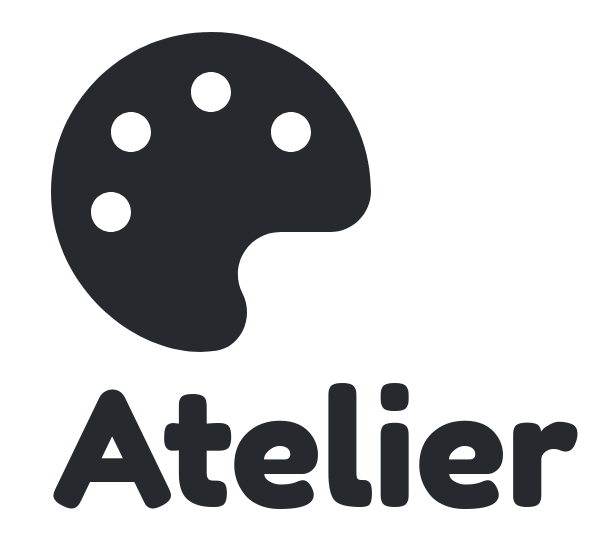

  

# Atelier Core

This repo contains the front-end and back-end of the atelier app. 
It does not contain the automated code checking please see atelier-PMD.

## Prerequisites
* Node.js ( & NPM)
* MongoDB
* Visual Studio Code (Recommended editor)

## Installing

1. Install all the Prerequisites.
2. Clone the Repo on your computer.
3. Open the project in your editor of choice ( I recommend Visual studio code) 
4. Run: `npm i`
4. Navigate to the /api folder. and run:
`npm run start`
5. Navigate to the /client folder. and run:
`npm run watch`
6. Open [localhost:5000](localhost:5000)

## Built with 

* [React](https://reactjs.org/) - Front end framework (written in Typescript)
* [Node.js](https://nodejs.org/en/)  with [express.js](https://expressjs.com/) - Back end Javascript server
* [Typescript](https://www.typescriptlang.org/) - A superset of Javascript

## Contributing
If you wish to contribute please, first make a branch named after yourself or the features you are implementing.

## Authentication 
Authentication is done using [JWT-tokens](https://jwt.io/) is a session less approach to user authentication.
Tokens are stored in local storage.

## Authors

* **[Andrew Heath](mailto:a.j.heath@student.utwente.nl)** - Full Stack - 

* **Margot Rutgers** - Full Stack

* **Carmen Burghardt** - Front-End and Design

### Helpful commands

Kill running process
fuser -k [port]/tcp 
