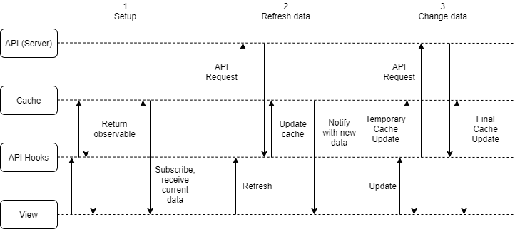

# Caching

In order to make the frontend feel as fast as possible, we try to store most information displayed on the frontend in a local cache. This cache is integrated into React, so the view is updated if the data in the cache changes. This also allows us to periodically refresh data and let the interface dynamically update when new data is returned from the server.

## General overview

The following figure shows three stages in the use of the cache. In the first stage, when a component that requires some data is loaded, the component calls the API hook for the data it needs. Let’s take the Activity view as an example, which displays a list of mentions. The Activity component calls the `useMentions()` function, which returns an observable of type `Observable<Mention[]>` and a function refresh that can be called to update the data in the cache with new data from the server.

An observable can be viewed as a stream of data, in the case of the Activity view, a stream of lists of mentions. When you subscribe to the observable, it will give you the current element of the stream. When new elements are added to the stream, the subscriber is notified of these values. So when the Activity view subscribes to the observable it received, it first gets back the current list of mentions in the cache and it is also notified when new mentions appear there.

To integrate this observable system with React, we use a library called observable-hooks. It turns an observable into a state object that can be integrated into the React views. When the observable gets a new item, the state is updated with this new value, which prompts React to rerender the components that make use of this value.

The cache object that provides these observables, is made available to all components in the application using the React Context functionality. The whole application is wrapped in a `CacheProvider` component, which is the element that provides access to this cache. Any subcomponent of the application can then get access to the cache with the `useContext()` hook, but this is usually done through API hooks like `useMentions()`, which in turn uses the context hook to access the cache.



The way new mentions can appear in the cache is shown in the second stage of the figure. The view can request a new version of the data from the server using the aforementioned refresh function. Calling this function will make a request to the server, after which the returned data is added to the cache. If the data is changed, the cache will notify its subscribers.

The refreshing of data is generally handled by a component called Cached. This component takes as one of its properties the response from an API hook and as another a function that can render the component children with the data returned from the cache. If the data is not yet available in the cache, this component will render a loading indicator instead, until the data becomes available. When the Cached component is rendered, it sets a timeout handler for the time it takes until the cache expires. When that happens, the refresh function gets called and new data will be displayed on the page.

The third stage of the figure shows what happens when the user changes data in Atelier, for example by creating a comment or a new submission. This change is made directly in the cache using a temporary object with the user-provided details filled in. These items are temporary because some information is determined on the backend, for example, the ID of the item. When the API request to actually make the change in the system is returned, the temporary cache item is replaced with the final one.

Let’s take a student submitting a new project as an example: the user selects a project and hits the upload button. The submission is immediately added to the cache and shows up in the list of submissions with a loading icon, to indicate that the submission is still being submitted. At the same time, an API request is made to actually submit the project. When the server responds, the cache is updated with the final information about the submission. The loading indicator on the submission vanishes and the user can now click on the submission to navigate to the corresponding page.

This approach of an ‘optimistic UI’ gives the user the feeling that their request has come through, even though it may still need to be processed on the server. To make sure the user is aware of this, we display a loading icon on items that are only temporary. Because the ID of an item is unknown at this moment, the user will not be able to click on the item, until the final response has come back from the server.

## Caching context and hooks

The caching context that makes the cache globally available across the application is defined in `general/loading/CacheProvider.tsx`, which makes use of [React's Context feature](https://reactjs.org/docs/context.html). This file contains the `CacheProvider` component, which creates the global cache and uses the `Context.Provider` component to make it available.

It also exposes three hooks that provide access to the cache:

- `useCacheCollection<T>(key, options?)`: returns a `CacheCollectionInterface<T>` for dealing with collections of type `T`, optionally filtered or sorted, as indicated in the options.
- `useCacheItem<T>(key, defaultValue?)`: returns a `CacheItemInterface<T>` for working with a single item in the cache of type `T`. If the item doesn't exist, an interface for a `CacheItem` with the default value is returned.
- `useRawCache()`: returns the Cache object itself, for uncommon operations on the global cache.

These all use the `useContext()` hook to get the Cache object from the current Context provider.

## API Hooks

The hooks to use the cache and API calls are all defined in the `APIHooks.ts` helper. This file contains some helpers for creating generic API requests and storing the returned data in the cache. The hooks all return an Observable for the cached data and optionally methods to refresh, create, update or delete items in that cache.

Here's an example of a hook definition for getting all submissions in a course and allows the creation of new submissions. First it requests the collection `submissions` from the cache, filtering on submissions that are made inside the requested course and sorting by the date of those submissions. A subKey of the courseID is specified, to make sure the loading state of the collection is not shared between courses.

```typescript
export function useCourseSubmissions(courseID: string): Refresh<Submission> & Create<[string, File[]], Submission> {
    // Get the CacheCollectionIterface for Submissions from the global cache
    const submissions = useCacheCollection<Submission>("submissions", {
        subKey: courseID,
        filter: submission => submission?.references?.courseID === courseID,
        sort: (a, b) => new Date(b.date).getTime() - new Date(a.date).getTime()
    });
    return {
        observable: submissions.observable,
        refresh: () => refreshCollection(API.getCourseSubmissions(courseID), submissions),
        defaultTimeout: 60,
        create: (projectName: string, files: File[]) =>
            create(API.createSubmission(courseID, projectName, files), { ... }, submissions)
    }
}
```

It then returns an object that implements the `Refresh` and `Create` interfaces, indicating that the cache can be refreshed and that new courses can be created. It exposes the cache observable directly and has two methods that provide a specific implementation for courses using the generic helper methods.

## Working with observables

If you are completely unfamiliar with observables, I recommend taking a look at the introduction on the [RxJS website](https://rxjs-dev.firebaseapp.com/guide/observable).

Sometimes, one of the operators in RxJS is useful when dealing with the cache. Take a look at this example:

```typescript
cache.getExport()
    .pipe(debounceTime(750))
    .subscribe(exported => Cache.save("cache", exported));
```

Here we get the observable for the exported cache, which returns a serializable version of the cache object every time the cache changes. We want to store this object in localStorage to make sure the cache persists across navigations, but we don't want to do this every single time when there are many cache changes right after each other. We'd rather wait until the cache is stable for some amount of time, and then persist it to storage.

To achieve this, we can use the [`debounceTime` operator](https://rxjs-dev.firebaseapp.com/api/operators/debounceTime), which waits for 750 ms before letting the item in the observable flow through. If a new item appears within that timespan, the previous item is discarded and the timer resets. This ensures that we only receive stable versions of the exported cache. Finally, we subscribe to this observable using a lambda function that accepts the exported cache and saves it to storage.

Another operator that is used in multiple places in the application is the [`map` operator](https://rxjs-dev.firebaseapp.com/api/operators/map), which corresponds to a map on a list. An example of it's use can be found in `submission/fileviewers/CodeViewer`:

```typescript
const snippetsObservable = useObservable(() =>
    commentsObservable.pipe(map(item => ({...item, value: getSnippets(item.value)})))
, [commentsObservable]);
```

It maps the list of comments that the `commentsObservable` returns, to a list of snippets that the CodeViewer can use to display highlights on the code file. Because this happens inside a React component, the `useObservable` hook is used to make sure the mapping is not executed on every render of the component.

## Using cached data in a component

The `Cached` component can be used to display cached data on a page and automatically refresh it based on a set timeout. Let's take this snippet for some course details as an example:

```tsx
const course = useCourse(courseId);
<Cached cache={course}>
    {course =>
        <Fragment>
            <h1>{course.name}</h1>
            <p>Created by {course.creator.name}</p>
        </Fragment>
	}
</Cached>
```

It takes the refreshable cache that is returned by `useCourse()` (which contains the observable, a function to refresh the data and the default timeout) and a function that renders this course. If the data is not available in the cache, the component will show a loading icon instead.

The component can also be used with a collection, where it will render each item in the cache using the specified render function:

```tsx
const courses = useCourses();
<Cached cache={courses} timeout={3600}>
    {(course, state) =>
        <PanelButton
            key={course.ID}
            display={course.name}
            location={`/course/${course.ID}`}
            state={state}
        />
    }
</Cached>
```

The render function can take a second argument for the state of an item, so a loading indicator can be shown on individual items that are still loading, for example because they have just been created. In addition the component also accepts a timeout attribute, which can override the default timeout set in the API hook.