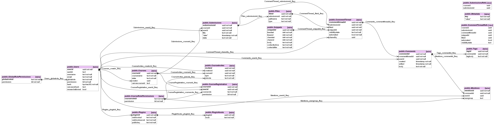

# Database

## Database structure

The structure of the database is defined in [DatabaseStructure.ts](/api/src/database/structure/DatabaseStructure.ts), which contains all SQL queries required to create the tables and views in the database.

This structure results in the following database schema. This diagram is for version **5** of the schema, please check in DatabaseStructure.ts if that is still the most recent version.



*Note for future documentation writers: this diagram was generated using [SchemaCrawler](https://www.schemacrawler.com/).*
`schemacrawler --command=schema --output-format=png --output-file=schema.png --server=postgresql --host=localhost --database=atelier --info-level=standard --no-info --grep-tables=.*View.* --invert-match`

### Views

To allow for somewhat complex return types from the database, a number of `TableNameView` views are set up in [ViewDB.ts](/api/src/database/ViewDB.ts). They contain more data than just the table itself, allowing to create the API models with just one query.
These are handy because any filtering that applies to a table below can be performed in one query, and results of inserts/update/delete can be retrieved in the same call.
(e.g. all commentThreads with 'draw' in the snippet body)

These views are created when Atelier starts, to ensure that the views in the database are in sync with the views used by the running version of Atelier.

The only exception to this, are the one-to-many relations that exist (submission-file, thread-comment)
It is currently impossible to collect these at the same time as the other data.
These can be added later, with dedicated methods that take the first query call as input.

Inserting, updating and deleting can (generally) only be done within a single table.
to return a full response, the ```WITH queryName AS (insert|update|delete ... RETURNING *)```) syntax is used.
The result of this query is the input for the view (for that table). (the modified table name is replaced with `queryName as`)

### Updating the schema

If the changes you make to Atelier requires changes in the database schema, you need to ensure that running instances of Atelier can update to this new schema without losing any data. If you update the schema defined in DatabaseStructure.ts, you need to increase the constant `VERSION` in that file to the next integer and create a migration with that version number in [DatabaseMigrations.ts](/api/src/database/structure/DatabaseMigrations.ts), by adding a new field to the `migrations` object. Please make sure that applying this migration to the old database schema results in the exact same structure as defined in DatabaseStructure.ts.

Note that migrations do not apply to views, as those are recreated on every start of Atelier, whether they are changed or not. If a view changes because of a schema change, you don't have to include those views in the migration.

## Querying the database

There are a set of classes with functions that handle all database connections. These can be found in [the database folder](/api/src/database).
Every file exports a class that contains methods to query one table. These methods will almost always return a model, containing the data retrieved from the database.
These functions handle things like conversion between data types and object transformation to adhere to the required model.

### Extra options (DBTools)

The input to the most methods is a large object that, besides the table fields, contains more options to configure the queries.
these include:

- limit: set a limit to what number of items is returned. (only used in selects)
- offset: start at location `offset` in the list of items with returning (only used in selects)
- sorting: an optional sorting the query tries to adhere to. what sortings are supported differs from method to method (currently only used within the search methods)
- client: when doing transactions, a client should be inserted, to let the query use that client when connecting to the database.
- currentUserID: the identifier of the user that is making the request. currently only used within search methods, where at the time of the query it has to be decided if a user is allowed to see that query.

### Permissions

When retrieving (course) users from the database, all permissions are set correctly. They are combined in the database.
NB: the permissions actually come back as a string of 40 binary digits, which are then converted server-side.

### Transactions

To perform transactions, you have to pass in the optional `client` argument to the functions that are part of the transaction. When this is passed, instead of starting a new connection, it uses that existing client to perform the query. The easiest way to perform a transaction then involves the `transaction` function in HelperDB.ts. It receives a callback function: the function that contains all transaction query. This callback receives as its first (and only) argument the client you need to pass to all database calls. The transaction function will take care of the transactional stuff such as BEGIN, COMMIT and ROLLBACK. (ROLLBACK will be run if the callback throws an error.)

Example usage:

```typescript
const submission = await transaction(async (client) => {
    const submission = await SubmissionDB.addSubmission({ ..., client });
    const file = await FileDB.addFile({ submissionID: submission.ID, ..., client });
    return submission;
});
```