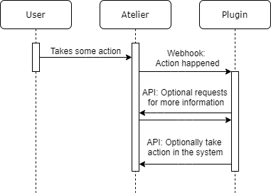
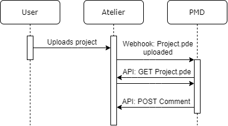

# Plugin system

One of the central parts of the Atelier project is the ability of automated code checking services to leave comments on the user’s code. For this to work, Atelier needs to be able to notify plugins that something happened and also allow plugins to make API requests to gather more data, create comments or otherwise influence the system, depending on the needs of the plugin.

The system we designed is inspired by the GitHub Applications API and has two basic building blocks: an API that an application can call to modify the system, and a Webhook integration that can notify plugins of changes in the system. The general flow for a plugin could look like this:



A user takes some action that the plugin has subscribed to. Atelier will then send a POST request to the plugin with some details about the event that occurred. The plugin can then use the API to get more information or to take some action in the system.

The body of the POST event is a JSON object with two fields: the event field is a string indicating the type of event; the payload field contains the object for which the event was created.

To make this a little more concrete, let’s take a look at the example of PMD, an automated code checking service. The PMD plugin is registered with the Atelier system by an administrator and configured to be notified when a file is created. When a student uploads a project to Atelier, the following flow will start:



Atelier sends a POST request to the PMD plugin with the standard information about a file, including the identifier in Atelier, name and MIME type of the file:

```json
{
    "event": "submission.file",
    "payload": {
        "ID": "RzGVeE4cSXu5-X3G8S4KwA",
        "name": "Project.pde",
        "type": "text/x-processing",
        "references": {
            "courseID": "HshfXh0_T4mYcO3FhrNdYw",
            "submissionID": "l1y6a6y3T8-V_9BDaM3UzA"
        }
    }
}
```

The PMD plugin can then decide if it can check the file, by looking at the file extension. If it is a .pde (Processing) file, it sends an API request to download the file contents. After running the checks, it makes some API requests to create comments on the file it just checked.

The plugin can use the same general API as is used by normal users via the frontend, but that does require every plugin to be registered as a user. This way a plugin can do anything a user would be able to do, without the entire system being duplicated to accommodate plugins. It also makes sure that plugins integrate with the permission system, to make sure it only has the access it requires to function. Lastly, it also makes it easy to enable or disable a plugin for a certain course, simply by registering the plugin as a user within the course.

Besides the general user data, we do need more information for a plugin to function. For example a list of events that the plugin subscribes to and the URL at which the plugin listens for Webhook requests. To enable a secure exchange of information between Atelier and a plugin, we store two more properties of a plugin: a Webhook secret and a public key. An administrator can configure all these settings when they register a plugin in Atelier. The next section explains how these last two settings are used.

## Security of plugins

There are two main problems of authentication with plugins: how does the plugin know that the Webhook was sent by Atelier and how does Atelier know that it’s the plugin making API requests.

The first problem is solved using the Webhook secret. Atelier uses this secret to calculate an HMAC signature of the Webhook request and sends it back in the `X-Atelier-Signature` header. The plugin can then verify this signature and, given that the secret is not shared with anyone else, be sure that the Webhook request was indeed made by Atelier. The plugin could also check that the User-Agent header is set to “Atelier,” but this provides little security, as an attacker could trivially do the same.

The second problem is solved using the public key, which also needs to be configured for the plugin. When the plugin wants to make an API request, it generates a JWT token using its private key. The issuer of the token has to be set to the user identifier of the plugin and the expiration time may be at most 10 minutes. The token is sent in the Authorization header to the */api/auth/token* endpoint to acquire a normal API token, just like the ones a normal user would receive when using the frontend. The plugin can then use this token to authenticate itself when making further API requests until the token expires.

Examples of how to validate a Webhook request and how to request an API token can be found in the */test/plugin* folder.

## Supported events

| Event             | Payload type | Description                                              |
| ----------------- | ------------ | -------------------------------------------------------- |
| `submission`      | `Submission` | Triggered on every new submission.                       |
| `submission.file` | `File`       | Triggered separately for every file of a new submission. |

